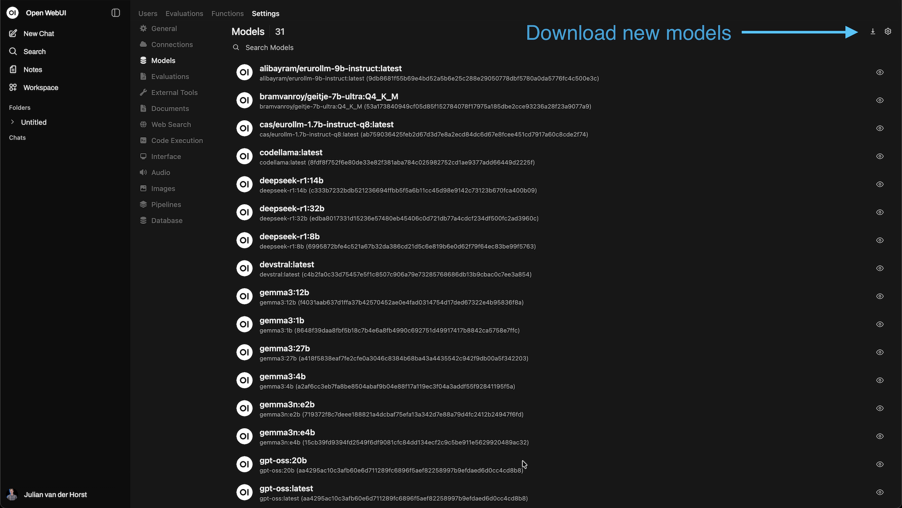

# **Managing the Environment**

## **First-Time Access**

### **User Management**

The first user to register automatically receives admin rights. After that, the settings can be adjusted in the admin panel.


New users can be added via the admin interface. (If you already have existing users, depending on the situation, there is an advanced option to link them https://docs.openwebui.com/features/sso/)

### **Connecting to Ollama**

Once everything has started and you can log in to Open WebUI, we still need to configure where Ollama is running.

- Click your user (bottom left)  
- Click Admin Panel  
- Click Settings  
- Click Connections  
- Then adjust the Ollama API connection to:  
```
http://host.docker.internal:11434
```


## **Managing Models**

### **Downloading Models**

After logging into the Open WebUI interface, you can download and manage models via the "Models" tab.



Some interesting models to start with are:

- **bramvanroy/geitje-7b-ultra:Q4_K_M**: A Dutch model  
- **deepseek-r1:8b**: A powerful Chinese reasoning model; interesting to see that a local model gives very different answers (e.g., about Taiwan) than the hosted service version  
- **gemma:7b**: A compact model from Google  
- **phi4:latest**: Microsoft’s model  
- **qwen:7b**: A versatile model from Alibaba  
- **mistral:7b**: A model from France  
- **llama2-uncensored:latest**: An uncensored version of LLAMA, interesting to compare differences with commercial variants that are more filtered  

**Downloading models via terminal**  
As an alternative, you can also download models from the command line:

1. Connect to the Ollama container  
```bash
docker exec -it ollama bash
```

2. Download a model (example: Deepseek-r1:14b)  
```bash
ollama pull deepseek-r1:14b
```

3. View the list of installed models  
```bash
ollama list
```

### **Model Limitations and Performance**

With the RTX 4070 Super (12GB VRAM), you can work with models up to around 14 billion parameters. Larger models such as Llama 3 70B or Deepseek-r1:32b won’t fit in the memory of this GPU.

You can use the following command to check current GPU memory usage:  

```bash
nvidia-smi
```

### **Adjusting Model Settings**

Open WebUI provides various settings to adjust model behavior, some interesting ones include:

- **Temperature** (0.0–2.0): Controls creativity/randomness. Lower values (0.0–0.3) give more deterministic, consistent answers; higher values (0.7–1.0) give more creative, varied answers.  
- **Top P** (0.0–1.0): Controls diversity. Lower values limit word choices to the most likely options.  
- **Context Length**: Maximum number of tokens the model can process, including input and generated text.  

Adjust these settings to experiment.  

### **Interesting Options**

Open WebUI also offers some other interesting options:

- **API endpoints** https://docs.openwebui.com/getting-started/api-endpoints/ – If you don’t want to use the interface but instead access a model programmatically, there’s an HTTP API option.  
- **System prompts** https://docs.openwebui.com/features/chat-features/chat-params/#system-prompt-and-advanced-parameters-hierarchy-chart – Lets you give specific instructions on how a model should behave during a chat.  
- **Filter functions** https://docs.openwebui.com/features/plugin/functions/filter/ – Lets you programmatically adjust incoming chat messages and LLM responses.  
- **Setting default prompts** – The admin can add prompt suggestions. Open WebUI comes with defaults like "Explain options trading," but these are in English and not always relevant to every organization. See screenshot.  


## **Management**

### **Local Network Access**

To make the interface available on your local network, change the port binding in `docker-compose.yml`:  
```yaml
ports:
  - "0.0.0.0:3000:8080" # 0.0.0.0 means available on all network interfaces
```

The interface will then be accessible via http://[server-ip]:3000 on your local network.  

### **External Access**

External access depends heavily on the network setup where the PC runs and will vary by organization. There are many options here. Things to consider include DNS (if you want external access via a URL), TLS for secure connections (often handled by a reverse proxy such as Apache, Nginx, or Caddy, possibly combined with Let’s Encrypt). Keep in mind: if it’s externally accessible, it is accessible to everyone (even if not everyone can log in). We currently use [Cloudflare Tunnel](https://developers.cloudflare.com/cloudflare-one/connections/connect-networks/).  

### **Automatic Updates with Watchtower**

To ensure your containers are updated automatically, we use Watchtower, which is deployed along with [docker-compose.yml](docker-compose.yml).  

## **Troubleshooting**

### **Common Problems and Solutions**

#### **GPU Not Recognized in Container**

**Symptom**: `nvidia-smi` works outside Docker but not inside the container.  

**Solution**:  

1. Check if the NVIDIA Container Toolkit is correctly installed  
```bash
sudo apt install nvidia-container-toolkit -y
```

2. Restart Docker and the containers  
```bash
sudo systemctl restart docker
docker-compose down
docker-compose up -d
```

#### **Ollama Loses GPU Connection**

**Symptom**: Models suddenly run much slower.  

**Solution**:  

1. Restart only the Ollama container  
```bash
docker-compose restart ollama
```

2. Check logs for possible causes  
```bash
docker-compose logs -f ollama
```

#### **Open WebUI Not Reachable**

**Symptom**: You cannot reach the web interface at localhost:3000.  

**Solution**:  

- Check if containers are running  
```bash
docker-compose ps
```

- Check logs for errors  
```bash
docker-compose logs ollama-webui
```

- Check if port 3000 is already in use by another service  
```bash
sudo lsof -i :3000
```

#### **Models Load Very Slowly**

**Symptom**: It takes minutes for a model to load.  

**Solution**:  

1. Adjust the `OLLAMA_KEEP_ALIVE` value in `docker-compose.yml`:  
   `environment: - OLLAMA_KEEP_ALIVE=5m # Keep model in memory for 5 minutes`  
2. Use smaller models if your GPU memory is limited.  
3. Check if other processes are using GPU memory with `nvidia-smi`.  

### **Interpreting Logs**

Open WebUI and Ollama generate logs that are useful for troubleshooting:

View the last 100 log lines of Ollama  
```bash
docker-compose logs --tail=100 ollama
```

Follow logs live (Ctrl+C to stop)  
```bash
docker-compose logs -f ollama-webui
```

Common error messages:

- **CUDA error: out of memory** – Your GPU does not have enough memory for the selected model.  
- **connection refused** – There is a problem with the connection between Open WebUI and Ollama.  
- **failed to pull model** – Problem downloading a model, usually a network issue.  
