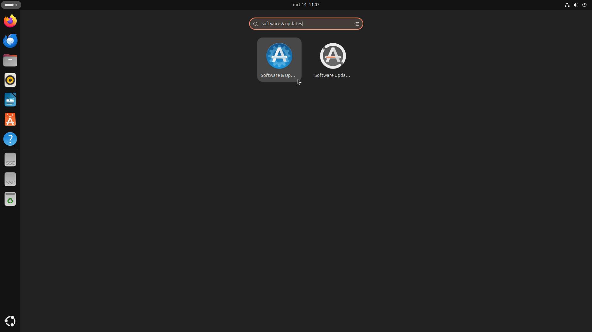
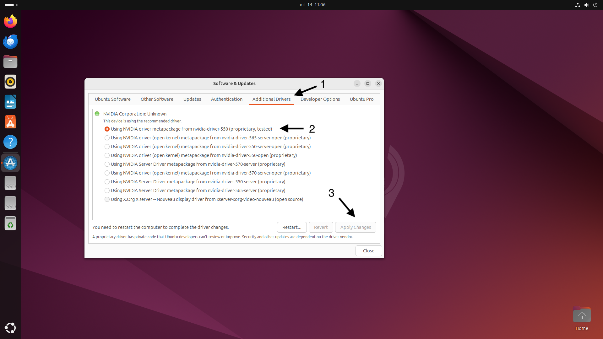

# **Software Installation**

### **Operating System**

We use Ubuntu as the operating system because of its strong support for Docker and the extensive technical documentation available online.

1. Download Ubuntu 24.04 LTS from the [official website](https://ubuntu.com/download/desktop)  
2. Create a bootable USB stick with [Rufus](https://rufus.ie/) (Windows) or [Etcher](https://www.balena.io/etcher/) (macOS/Linux)  
3. Install Ubuntu on your computer using the installation wizard  

   a. Choose "Install third-party software for graphics and Wi-Fi hardware" to ensure the correct NVIDIA drivers are installed.  
   b. Optional: Choose "Encrypt the new Ubuntu installation" for extra security (note: this may complicate remote management, since a password will be required at startup to decrypt the hard drive).  

In this article, several commands are shown. These must be executed in the terminal. You can open a terminal with "CTRL" + "ALT" + "T" or by searching for it among your applications.

### **Installing NVIDIA Drivers**

To use the GPU, NVIDIA drivers must be installed:

1. Update package sources  
```bash
sudo apt update
sudo apt upgrade -y
``` 

2. Install NVIDIA drivers  
Press the SUPER key (Windows key) and type:  
`Software & updates`



Click on the `Additional Drivers` tab and select the newest (currently nvidia-driver-550) proprietary tested driver. (If this is already selected, you don’t need to do anything).  



3. Restart the system  
```bash
sudo reboot
```

After rebooting, check whether the GPU is recognized:  

```bash
nvidia-smi
```

This command shows information about your GPU, including current usage. You should see an output similar to:  

```
+-----------------------------------------------------------------------------+
| NVIDIA-SMI 535.129.03   Driver Version: 535.129.03   CUDA Version: 12.2     |
|-------------------------------+----------------------+----------------------|
| GPU  Name        Persistence-M| Bus-Id        Disp.A | Volatile Uncorr. ECC |
| Fan  Temp  Perf  Pwr:Usage/Cap|         Memory-Usage | GPU-Util  Compute M. |
|                               |                      |               MIG M. |
|===============================+======================+======================|
|   0  NVIDIA GeForce ...  Off  | 00000000:01:00.0  On |                  N/A |
| 35%   45C    P8    21W / 200W |    234MiB / 12288MiB |      0%      Default |
|                               |                      |                  N/A |
+-------------------------------+----------------------+----------------------+
```
